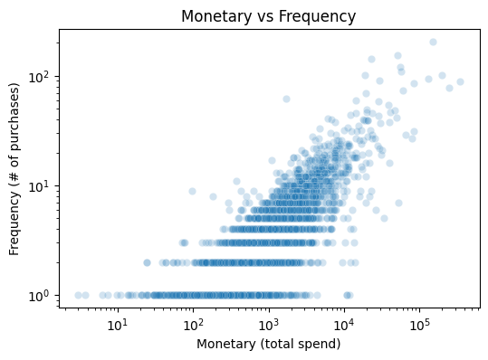
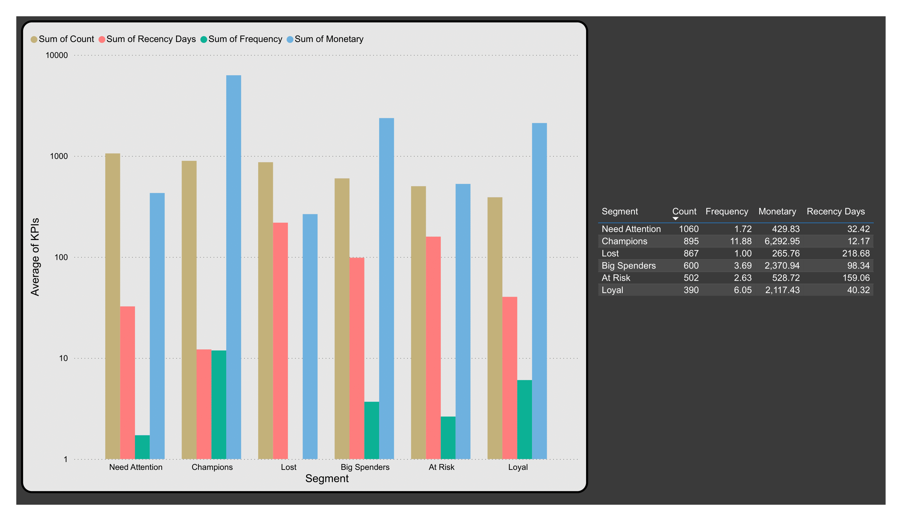
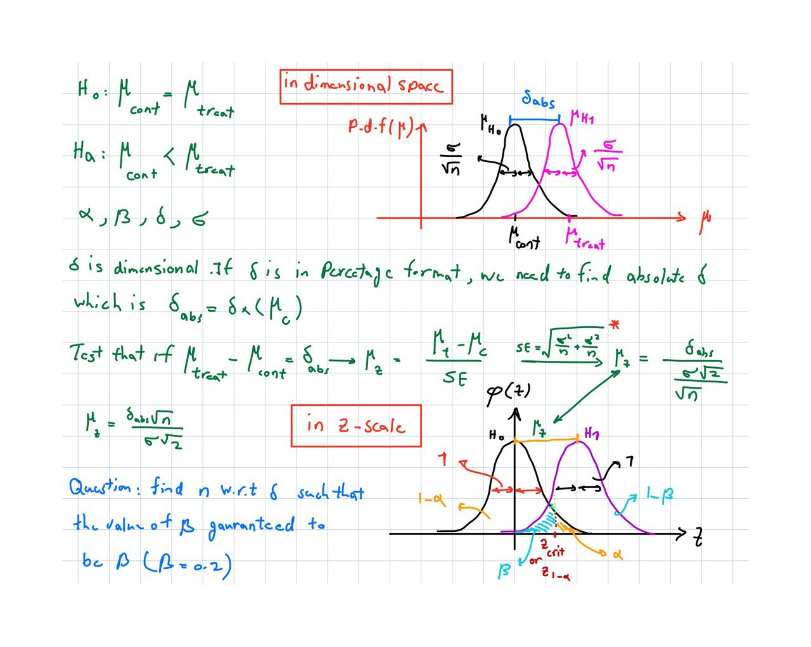
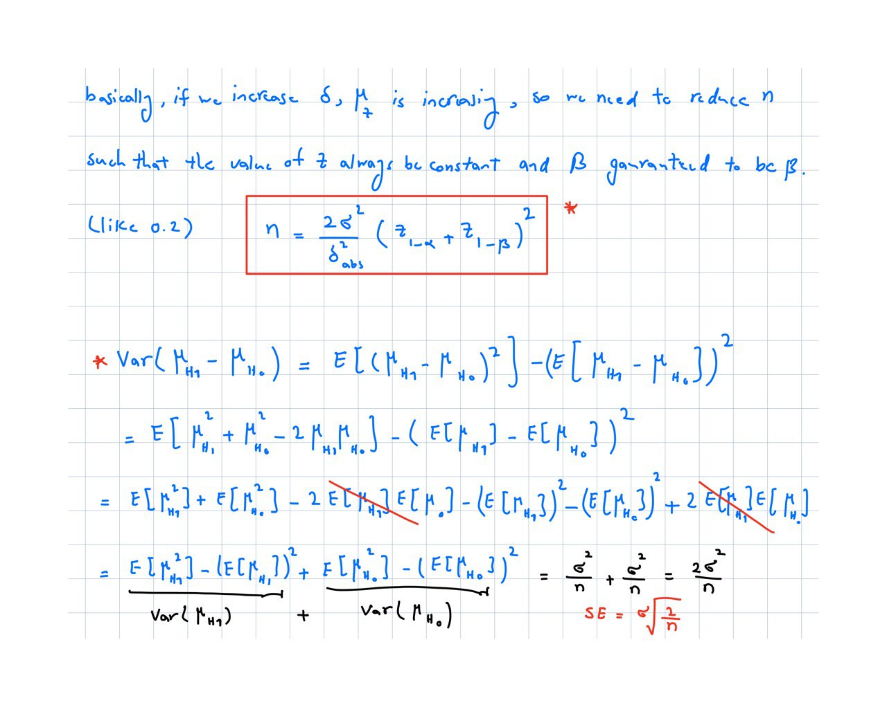
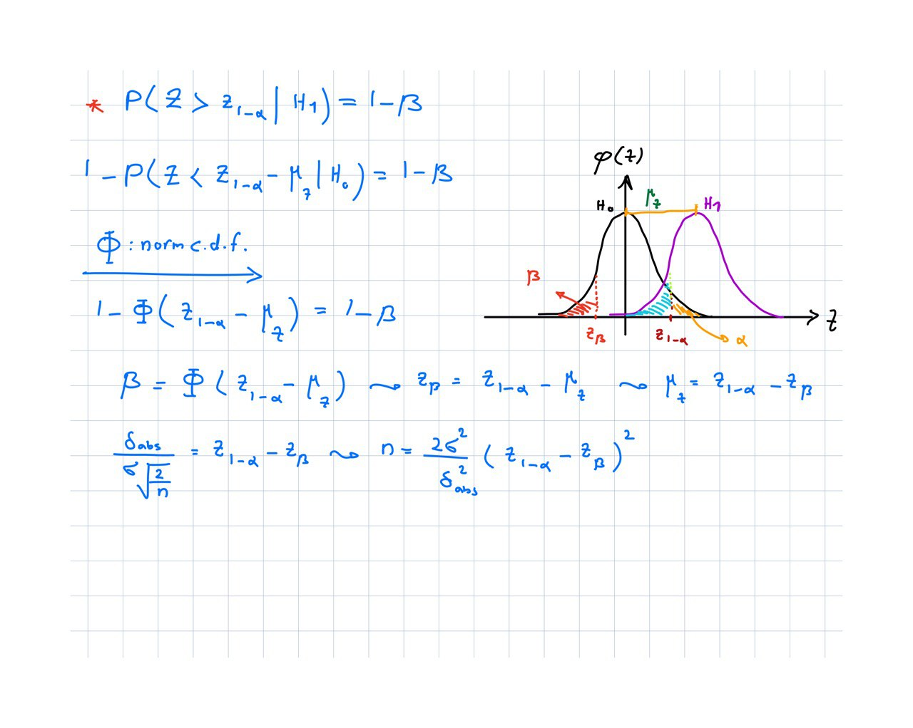

# online-retail


## 1. 🛠️ Installing Poetry

To install [Poetry](https://python-poetry.org/) (Python dependency management and packaging tool), run the following command in your terminal:

```bash
curl -sSL https://install.python-poetry.org | python3 -
```

After installation, make sure Poetry is in your `PATH`
- macOS/Linux
```bash
export PATH="$HOME/.local/bin:$PATH
```

Verify installation:

```bash
poetry version
```

Keep venv inside the project (works great with VS Code) poetry 

```bash
config virtualenvs.in-project true
```
This environment is set with Python 3.13. Change the requires-python = ">=3.13" in pyproject.tmol file if you have other versions on your PC.

run:
```bash
poetry install
```

In case if you want to make environment from scratch, run:(Do not recommended)

```bash
poetry new project_name
```
## 2. Source of Data

Data is in `data` folder, but you can download from:
[Kaggle Link](https://www.kaggle.com/datasets/lakshmi25npathi/online-retail-dataset/data)

## 3. Exploratory Data Analysis (EDA)

`src/online_retail/EDA.ipynb`

Explanation of this section is in the notebook file. Install data wrangler in VSCode for having better experience. In this file, I did Exploratory Data Analysis (EDA), which is RMF analysis. RMF analysis is:<br>
R -> Recency: How recently a customer made their last purchase -> more engaged and more likely to buy again.<br>
F -> Frequecy: How often a customer purchase -> Loyal customers.<br>
M -> Monetary: How much they spent -> spend a lot have more value.<br>
This is a study that is used for customer segmentation technique. RFM is a `KPI` to segment the customers. The goal is to quantify customer value and behavior. So using these three criteria, we can segment our customers into 5 categories.<br>
1. Champions -> High RFM -> loyal and active.<br>
2. Loyal -> High F but regular M -> Regular customer.<br>
3. Big Spenders -> High M low F -> High value but occasional<br>
4. At Risk -> Used to buy but not now -> At risk for churn<br>
5. Lost -> Have not purchased for a long time.<br>

At the end, I generated a clean table, that contain RMF columns, and score each customer using RMF features. Based on the histogram analysis, Recency has exponential distribution `log(y)=mx+b`, Monetry has log-normal distribution `log(x) ~ N`, and Frequency has power-law distribution `log(y) = mlog(x)+b`. The correlation analysis shows there is a Positive correlation ($\rho = 0.65$) between Monetary and the frequency. It is evident in Fig1. as well.


Fig 1: Joint scatter plot of Monetray and Frequency.<br>

<br>


## 4. Customer segmentation

`src/online_retail/cust_seg.ipynb`

Next, we want to segment our customers into 5 different groups `[Champions, Loyal, Big Spenders, At Risk, Lost]`. To do so, I give a score to each customer for each RMF feature based on quantile analysis. Customers with `R_score >= 4, F_score >= 4, M_score >= 4` are `Champions`. Customers with `R_score >= 3, F_score >= 4` are `Loyal`. Customers with `M_score >= 4` are `Big Spenders`. Customers with `R_score <= 2, F_score >= 3` are `At Risk`. Customers with `R_score <= 2, F_score <= 2` are `Lost`. `Need Attention` customers could be new customer who have high `R_score`, but low to mid `F_score`, and `M_Score`(i.e., averagly they just had 1.7 transaction within the last 32 days). The figure below shows a bar plot of the average KPIs for different customer segments.

<br>

## 5. Hypothesis testing

One of the important topics we should know before A/b testing, is hypothesis testing. For hypothesis testing we have a null hypothesis H0 (unfavorable condition) and try to reject the null hypothesis using alternative hypothesis Ha (favorable). <br>
Let us design a problem. <br>
Class A: has IQ scores<br>
Class B: has IQ scores<br>
You want to know:
Is the average IQ of Class A statistically significantly different from the average IQ of Class B? <br>
H0: $\mu_{A} = \mu_{B}$<br>
Ha: $\mu_{A} \neq \mu_{B}$<br>
This is a two-sided test because we don’t specify which class is higher. Always remeber,$\mu$ is the mean of the distribution of the mean of the samples which based on CLT is Gaussian (take n samples out of population m times and calculate the mean of the sample each m times. The distribution of the mean of the samples is normal and has mean of $\mu$ and std of $\frac{\sigma}{\sqrt{n}}$ or standard error. As $n$ increases, SE reduces). <br>
Sample mean and sample standard deviation or standard error(SE):<br>
For class A: Mean of class: $\mu_{A}$, Standard deviation of class: $s_{A}$, Sample size: ​$n_{A}$, Standard deviation of the mean distribution based on CLT(SE): SE = $s_{A}/\sqrt{n_{A}}$<br>
For class B: Mean of class: $\mu_{B}$, Standard deviation of class: $s_{B}$, Sample size: ​$n_{B}$, Standard deviation of the mean distribution based on CLT(SE): SE = $s_{B}/\sqrt{n_{B}}$<br>
as the number of samples increases, the standard deviation of the mean distribution reduces and we approaching the true mean of the population. To judge whether these two classes are statistically significantly different or not, we need to subtract the two means $\mu_{A}-\mu_{B}$, and divide by standard deviation of the subtracted mean distribution $\sqrt{\frac{s_{A}^2}{n_{A}}+\frac{s_{B}^2}{n_{B}}}$ to standardize the value and use famous test statistics like t-test, z-test, F-distribution, $\chi^2$ test, etc. If number of sample be less than 30 or we do not know about the standard deviation of the population $\sigma$ and we only have standard deviation of the sample $s$, we use t-test, otherwise we use z-test. The only reason that we use test statistics is to compare with standard distributions. The more general form of the test statistics is when we have two means ($\mu_{0}$ of null hypothesis and $\overline{X} of $n$ samples out of the population which have SE =$s/\sqrt{n}$) and one sample of true standard deviation is:<br>
test statistics = $\frac{\overline{X}-\mu_{0}}{s/\sqrt{n}}$<br>
For z distribution, $s$ transform to $\sigma$ because we know the std of the population.<br>
Based on the significance level $\alpha$, we can $t_{crit}$ or $z_{crit}$ based on the employed test statistics and compare it with our test statistics. We may reject the H0 or fail to reject the H0. We also can find $p_{val}$ and compare it with $\alpha$. $p_{val}$ is the probability of our test statistics which the area under the curve. If $p_{val}<\alpha$, we can reject the null hypothesis.<br>
To compute the confidence interval (CI), we use the following formula:<br>
CI = [$\overline{X}-\mu \pm t_{crit}*SE$]<br>
Confidence interval says that, with the probability of $(1-\alpha)*100$, the difference between $\overline{X}$ and $\mu_{0}$ is residing in that interval. Null hypothesis says, the difference is zero, which means $\overline{X} - \mu_{0} = 0$. If CI cover 0, we fail to reject the null hypothesis, otherwise we can reject the H0. As the SE increases, unertainety increases, so the range CI convers increases and it is getting harder to reject the null hypothesis. $t_{crit}$ can be changed to $z_{crit}$ if we change the test statistics.

## 6. A/B testing

Business Question: The company runs an expensive training program for salespeople during the last three months of the year (October–December). Only half of the salespeople are trained. We want to know:<br>
Does assigning customers to trained salespeople increase customer spending enough to justify the cost of the training program?<br>
We randomly assigned customers to trained and untrained sales persons. Customers with `CustomerID % 2 == 1` are assigned to trained customers and customers with `CustomerID % 2 == 0` are assigned to untrained customers.
### process for A/B testing
- Hypothesis of A/B testing:
Bussiness hypothesis describe what two product are being compared and what is the desired impact on the product. In this step we should consider what issue we want to fix and which KPI should be tracked to see the influence of the changes in the product. Single Primary Metric should be used to evluate the results of the A/B testing, whether statistic of the control group (old version of the product) and treatment group (new version of the product) are significantly different or not.
For choosing the Metric, we should always answer this question: By keep all parameters constant and choosing the Metric, would we achieve our goal? like conversion rate or click through rate(CTR)
The question is What metric we should use here?<br>
For each customer in the Oct–Dec window, we compute:<br>
`Monetary_Q4` = total amount spent by that customer in this period. This is the KPI we’re comparing between treatment and control. Is the average Q4 spending (`Monetary_Q4`) higher for customers served by trained salespeople than for those served by untrained salespeople?
H0: The `Monetary_Q4` for control and treatment group are the same ($\mu_{T}=\mu_{C}$).
Ha: The `Monetary_Q4` for treatment group is higher than control group ($\mu_{T}>\mu_{C}$) which is one-sided test.
- Design A/B testing:
1. Power analysis:<br>
FP: The probability of rejecting the null hypothesis when it true(Significance level(type I error): $\alpha$). This is the risk that we take to reject the H0 when it is actually true. This values is used to calculate the Confidence Interval($t_{crit}$ or $z_{crit}$).<br>
FN: The probability of rejecting the alternative hypothesis when it is true (tyep II error: $\beta$). This is also a risk we take to reject the Ha when it is actually true. We use $\beta$ when we want to find minimum sample size. This parameter is not used for statistical analysis.<br>
TP: The probability of rejecting the null hypothesis when it is wrong(Power = 1- $\beta$)<br>
TN: The probability of rejecting the alternative hypothesis when it is wrong (Confidence level= 1- $\alpha$ ). This probability is used to analyze the CI. If with high probability (1- $\alpha$ ) the CI covers a narrow range, we can confidently conclude the test with high accuracy.<br>
P: rejection of H0 or approval of Ha.<br>
N: approval of H0 or rejection of Ha.<br>
Basically, we always take two risks $\alpha$ and $\beta$. If we want to be conservative, support H0 more than Ha, we choose $\alpha$ less than $\beta$.
- Choosing the probability of correctly rejecting the null hypothesis (TP = 1- $\beta$) in which $\beta$ is type II error(FN: the probability of failing to accept the alternative hypothesis when it is true), it is common to choose power = 80%. We are ok with failing to reject the null hypothesis when it is wrong 20 percent of times.
- Significance level ($\alpha$): The probability of rejecting the null hypothesis while it is true(type I error or FP). When $\alpha = 0.05$ there is 5 percent change of concluding that there is significance difference between control and treatment group when there is no actual difference. If the implementation of the new model is expensive, we should choose smaller $\alpha$ to harder reject the null hypothesis, unless there is significance difference between treatment and control.
- Minimum Detectable Effect (MDE) or $\delta$: What is the minimum amount of change we aim to observe in the new version to lunch the new version. There is no normal amount that can be considered and usually it is determined by stakeholders. it can be 1% for one product and 5% for another product. This variable is used for computing practical significance. If MDE be less than the lower bound of the CI, we can say the model is practically significant.
2. Minimum Sample Size: To avoid bias results, we need to determine minumum number of samples that we should take out of the population. H0: $\mu_{control}$ = $\mu_{treatment}$. Ha: $\mu$ control is less than the $\mu$ treatment.<br>
Based on CLT, the distribution of the mean of the sample follows the normal distribution. So $\overline{X_{con}} = N(\mu_{con}, \sigma_{con})$ , $\overline{X_{exp}} = N(\mu_{exp}, \sigma_{exp})$, $\overline{X_{con}} - \overline{X_{exp}} = N(\mu_{con}-\mu_{exp}, \sigma_{con}^{2}/N_{con}+\sigma_{exp}^{2}/N_{exp})$ N = $\frac{(\sigma_{con}^{2}+\sigma_{exp}^{2})*(z_{1-\alpha/2}+z_{1-\beta})^{2}}{\delta^{2}}$ derived based on AA testing. As the risks we are taking increases, $\\alpha$ and $\\beta$, the number of samples needed for the test reduces. If MDE be small, then we need more samples to detect the rise in the outcome. Large $\delta$ is a stronger signal, so it is easier to be detected so we need fewer samples. The smaller the effect you want to detect, the more data(samples) you must collect. The bigger the effect, the easier it is to detect, so fewer samples are needed. Basically, $\delta$ is the difference between the peaks of the H0 and Ha distributions which are normal due to CLT. The value of $\beta = 0.2$ is not guaranteed before hand unless we take enough number of samples. If the value of $\delta$ be small($\delta=1%$, peaks are so close to eachother. In order to guaranteed $\beta = 0.2$, we need to reduce the standard error ($\sigma/\sqrt{n}$) which is standard deviation of the mean sample distribution. By increasing the number of samples, we reduce SE and guaranteed that $\beta = 0.2$. For larger $\delta$, the peaks are distant from eachother and it is easier to guaranteed $\beta$. So by lower number of samples and larger SE, we can statistically prove that H0 and Ha are different. However, it gets harde to prove that it is practically significant (CI covers wider range). For our case $ n = \frac{2\sigma^{2}}{\delta_{abs}}*(z_{1-\alpha}-z_{\beta})^{2}$ which is found by solving $\beta = P(Z<z_{crit}|H1)$.<br>
<br>
<br>
<br>
3. Test duration: N/(average # of visitors per day) considers the factors like Christmas can affect the number of visitors of the page. So do not run the experiment in those days which result into inaccurate conclusion.<br>
Too small test duration result into novelty effect. Users tend to react quickly to a new platform which is considered illusionary.<br>
Too long test duration result into maturation effect in which the test is affected by the external parameters.<br>
For our study, the duration of the study should be such that we have enough number of customers in each group.
- If the test is statistically and practically significant and the CI is narrow, it shows the test is performed accurately, and precision is high, and we can generalize the test.


## 7. Causal inference
For the causal inference also we need to have treatment and control group. However, the test is not run in randomized way and we need to use previous experimental data(test can not be re run). Not randomizing the samples to control and treatment group my causes biased result and confonded by other parameters. In causal inference we are trying to infere by removing the effect of the confond parameters which comes from not randomized controled test(RCT). In the case we had here, the A/B test is done in Christmas time. So by default the sale is high. I know that if sale in treatment was high so the sale in control also should have been high, but the trained sales persons may had better performance in Christmas time. We want to see whether the results are affected by the season or not.